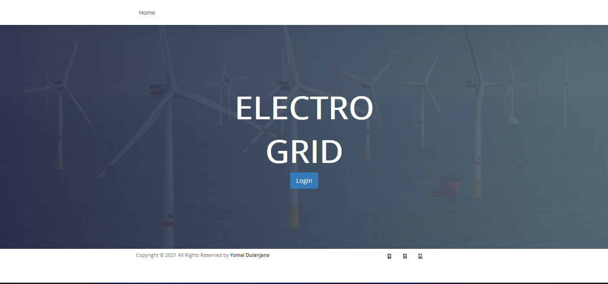
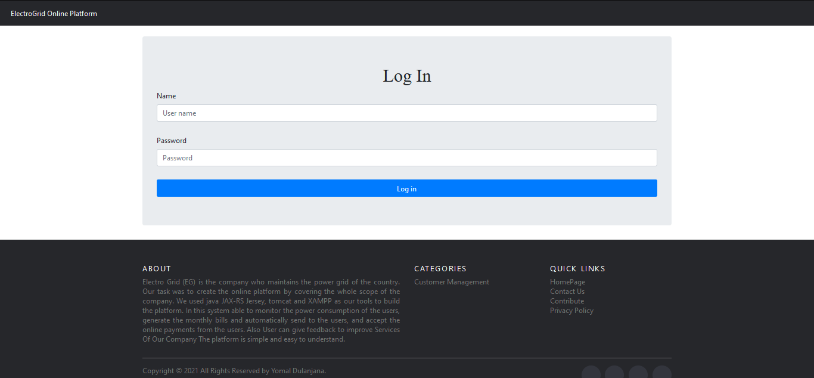
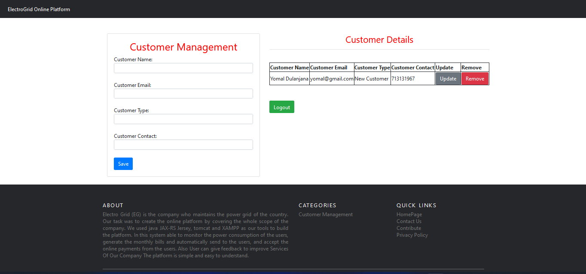

# ElectroGrid_ClientSide

# About my project?
My project is based on an Electro Grid (EG) is the company who maintains the power grid of the country online platform. I have implemented 2 functions in this system and they are customer function and login function.

#  The technologies we used were
-  java JAX-RS(jersy) Restful web service  
-  Apache  Tomcat  
-  mysql as the database 
-  eclipse IDE.

# How to execute the project?
Import the ElectroGrid_Clientside DB then clone the project and after it become cloned by using apache tomcat server the project can be executed. Execute the Index.jsp file through apache tomcat server and when the login user interface appear give the username and password which have been stated below.

-  Username: yomal
-  Password :it20121242

#  Link  To GadgetBadget_clientside Database
https://github.com/Yomal-Dulanjana/ElectroGrid_ClientSide/blob/main/Database/electrogrid_clientside.sql

#  Developer

-  Serasingha K.A.E.Y.D.          --IT20121242

# Screenshot of the UI

<h1>Homepage</h1>

<h1>Login page</h1>

<h1>Customer Management</h1>

   
